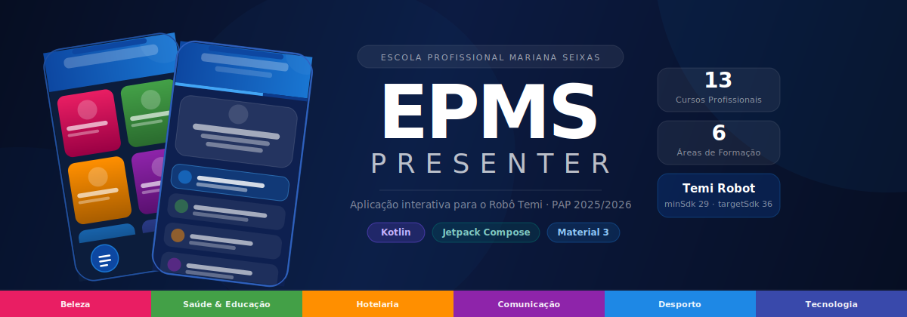

<p align="center">
  
</p>

> A Jetpack Compose Android application designed to run on the **Temi robot** at [Escola Profissional Mariana Seixas (EPMS)](https://epms.pt), presenting the school's 13 vocational courses to prospective students in an interactive, engaging way.

---

## About

This app was built as a **PAP (Projeto de Aptidão Profissional)** — the final certification project — by students of the *Eletrónica, Automação e Computadores* course at EPMS. It runs on a Temi social robot designed to help students present the school on outreach events, allowing the interested ones to browse courses, ask questions to a chat assistant, and discover which course best suits them through an interactive quiz.

---

## Features

### Course Catalogue
- **13 professional courses** displayed in an adaptive card grid
- Each card shows the course icon, name, short description, and a tap-to-learn-more prompt
- Cards animate in with staggered spring transitions on load

### Course Detail View
- Full course information: description, competencies, curriculum components with hours, and career paths
- **Text-to-Speech** reads the full course aloud in European Portuguese
- Animated icon with triple glow ring effect
- Scrollable content with staggered entrance animations

### Chat Assistant
- Floating chat overlay (💬 FAB) available on all screens
- Predefined FAQ chips covering common questions about the school
- Simulated typing indicator with animated dots
- TTS reads bot responses aloud
- **"Descobre o teu curso"** banner — starts the course-finder quiz directly from chat

### Course Finder Quiz
- 6 questions in European Portuguese covering interests, working style, and personality
- 4 answer options per question, auto-advances on selection
- Animated progress bar and slide transitions between questions
- Scoring engine matches answers to individual course IDs
- Results screen shows the top 3 recommended courses with a "Melhor correspondência" badge on the #1 pick
- Tapping a result navigates directly to that course's detail page

### Dark Mode
- Toggle between light and dark themes via the header button
- Background colour animates smoothly on switch (450 ms fade)
- Sun/moon icon swaps with a scale-fade animation

### UI & Polish
- Edge-to-edge blue gradient header extends behind the status bar
- Material Design 3 colour system with custom EPMS brand colours
- Poppins font family throughout
- Category-specific gradient colours for course cards (Beauty, Health, Hospitality, Communication, Sports, Technology)

---

## Screenshots

| Main Screen | Course Detail | Chat Assistant | Course Finder Quiz | Results |
|:-----------:|:-------------:|:--------------:|:------------------:|:-------:|
| *(course grid)* | *(detail + TTS)* | *("Descobre o teu curso")* | *(quiz questions)* | *(top matches)* |

---

## Tech Stack

| Layer | Technology |
|---|---|
| Language | Kotlin 2.2 |
| UI Framework | Jetpack Compose (BOM 2026.02.01) |
| Design System | Material Design 3 |
| Image Loading | Coil 3 + OkHttp |
| Text-to-Speech | Android TTS (locale: `pt-PT`) |
| Min SDK | 29 (Android 10) |
| Target SDK | 36 |
| Build System | Gradle 9 + AGP 9.2 |

---

## Project Structure

```
app/src/main/java/com/example/temiepmspresenter/
├── MainActivity.kt                  # Single-activity host, screen navigation
├── data/
│   ├── Course.kt                    # Course & CurriculumComponent data classes, CourseCategory enum
│   ├── CourseRepository.kt          # All 13 hardcoded courses with full details
│   ├── ChatData.kt                  # Chat message models and FAQ options
│   └── CourseFinderData.kt          # Quiz questions, answers, and scoring engine
└── ui/
    ├── screens/
    │   ├── MainScreen.kt            # Home grid with animated cards
    │   ├── CourseDetailScreen.kt    # Full course info + TTS
    │   ├── CourseFinderScreen.kt    # Quiz + results screen
    │   ├── CreditsScreen.kt         # Team credits
    │   └── ChatOverlay.kt           # Floating chat panel + FAB
    └── theme/
        ├── Theme.kt                 # Light/dark colour schemes
        ├── Color.kt                 # Brand and semantic colours
        ├── CategoryColors.kt        # Per-category course card colours
        └── Type.kt                  # Poppins typography scale
```

---

## Courses Included

| Category | Courses |
|---|---|
| Beleza | Cabeleireiro/a · Esteticista |
| Saúde & Educação | Técnico/a de Ação Educativa · Técnico/a de Auxiliar de Saúde |
| Hotelaria | Técnico/a de Cozinha e Restauração |
| Comunicação | Técnico/a de Comunicação – Marketing, RP e Publicidade |
| Desporto | Técnico/a de Desporto |
| Tecnologia | Técnico/a de Desenvolvimento de Software · Técnico/a de Eletrónica e Automação · Técnico/a de Informática de Gestão · Técnico/a de Multimédia · Técnico/a de Produção de Conteúdos Interativos · Técnico/a de Sistemas de Computação e Redes |

---

## Getting Started

### Prerequisites
- Android Studio Meerkat (or later)
- JDK 21 (bundled with Android Studio)
- Android device or emulator running API 29+

### Build & Run

```bash
# Clone the repository
git clone https://github.com/nedizin/epms-presenter.git
cd epms-presenter

# Open in Android Studio, or build from the command line:
./gradlew assembleDebug

# Install on a connected device
./gradlew installDebug
```

> **Note for Windows users:** If Gradle can't auto-download the JDK toolchain, set `JAVA_HOME` to Android Studio's bundled JBR before running Gradle:
> ```powershell
> $env:JAVA_HOME = "C:\Program Files\Android\Android Studio\jbr"
> .\gradlew assembleDebug
> ```

---

## Navigation

The app uses a simple sealed-class navigation system managed in `MainActivity` — no Navigation Compose library. Screen transitions use `AnimatedContent` with custom slide + fade specs.

```
Screen.Main  ──tap course──►  Screen.Detail(course)
     │                               │
     │◄──────── onBack ──────────────┘
     │
     ├──tap credits──►  Screen.Credits
     │
     └──chat quiz──►  Screen.CourseFinder  ──tap result──►  Screen.Detail(course)
```

---

## Team

Developed by **Grupo 1 – Turma 3EAC**, EPMS 2025/2026:

| Name | Initials |
|---|---|
| Simão Pereira | SP |
| Arthur Cabral | AC |
| José Fernando | JF |
| Micael França | MF |

---

## License

© 2026 Escola Profissional Mariana Seixas. All rights reserved.  
This project was created for educational purposes as part of the PAP assessment.
